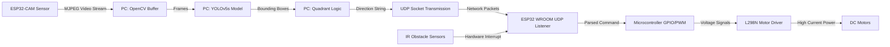
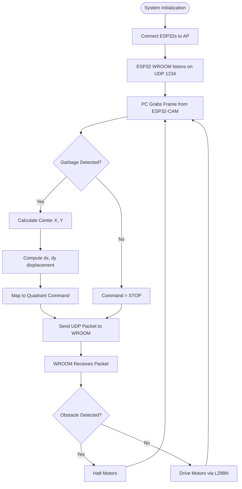

# AI-Powered Autonomous Waste Catching System

**Session:** 2024 - 2028  
**Submitted by:**  
- Muhammad Umar Javed (2024-CS-190)  
- Muhammad Husnain (2024-CS-221)  
- Sunil Romi (2024-CS-55)  

**Supervised by:** Syed Tehseen Ul Hasan Shah  
**Subject:** CSC-205L Computer Organization & Assembly Language  
**Department of Computer Science**  
**University of Engineering and Technology Lahore**  
**Lahore, Pakistan**  

---

## Abstract
The "Smart Garbage Basket" is a hardware-software co-designed embedded system capable of autonomously positioning itself to catch thrown trash. The system bridges high-level artificial intelligence with low-level microcontroller architecture. It utilizes an ESP32-CAM for real-time video acquisition, a central processing laptop running an offline YOLOv5s object detection model, and an ESP32 WROOM microcontroller for physical actuation. By offloading heavy matrix computations to the PC and utilizing the Xtensa dual-core architecture of the ESP32 for real-time network parsing and PWM motor control via an L298N driver, the project demonstrates a complete closed-loop cyber-physical system communicating continuously via low-latency UDP sockets.

## Introduction
In lecture theatres, students frequently miss when throwing trash (paper balls, plastic bottles) toward a fixed bin, resulting in floor litter. Traditional fixed bins cannot react to the trajectory of thrown objects. Our solution leverages computer vision and embedded systems to create a motorized basket that tracks and catches falling garbage in real time. 

From a Computer Organization and Assembly Language (COAL) perspective, this project explores hardware-software interfacing, wireless embedded networking, and microcontroller peripherals. The system demands highly efficient data flow: capturing high-speed image matrices, routing them through a wireless network stack, computing bounding box localizations, and ultimately translating these high-level coordinates into raw PWM (Pulse Width Modulation) and GPIO voltage signals to drive physical DC motors.

## Methodology
The methodology is divided into three core subsystems spanning from data generation to physical execution:

1. **Hardware Assembly & Peripherals:** 
   The mechanical base is driven by DC motors connected to an L298N motor driver. The ESP32 WROOM microcontroller acts as the central embedded brain, wired to the L298N's directional (IN1-IN4) and speed (ENA, ENB) pins. Two IR sensors are integrated using hardware interrupts to instantly halt the motors upon detecting physical obstacles, bypassing the software loop for safety. An independent ESP32-CAM module is mounted on the frame to act as the visual sensor.
   
2. **AI & Vision Pipeline (YOLOv5s):** 
   A custom dataset of 300–400 images of plastic bottles and crushed paper was captured directly using the ESP32-CAM to ensure the model learned the exact sensor characteristics. The dataset was annotated in Roboflow, applying augmentations like rotation and brightness shifts. It was then trained locally on a laptop using the single-stage Ultralytics YOLOv5s architecture. The trained weights (`best.pt`) allow the system to detect garbage at 15–25 FPS. Quantitative metrics achieved on the validation set include:
   - **Overall mAP@50:** 82.1%
   - **Precision:** 77.8%
   - **Recall:** 85.8%
   - **Class-Specific mAP@50:** Crushed Paper (87.0%), Plastic Bottle (77.0%).

3. **Hardware-Software Interfacing (Network & Control):**
   The ESP32-CAM streams MJPEG video over an Access Point (`192.168.4.1`). A multi-threaded Python script on the laptop grabs these frames, runs the YOLOv5s inference, and calculates the target's displacement `(dx, dy)` from the center of the camera frame. This displacement is mapped to a directional command (e.g., `FWD_RIGHT`, `STOP`). The laptop then encodes this command into a byte packet and transmits it over a UDP socket to the ESP32 WROOM (`192.168.4.2:1234`), which parses the byte stream and manipulates its GPIO registers to actuate the motors.

## Implementation
The implementation relies heavily on the integration of microcontrollers and external processing power. 

- **Embedded Control (ESP32 WROOM):** Operates on an Xtensa 32-bit LX6 microprocessor. It connects to the local Wi-Fi and listens on a specific UDP port. When a datagram arrives, the firmware evaluates the payload and updates the duty cycle of the PWM channels linked to the L298N driver, allowing for differential steering (e.g., spinning the left motor faster than the right to achieve a diagonal trajectory).
- **Inference Node (PC):** Runs a Python pipeline utilizing PyTorch and OpenCV. To minimize latency, video fetching runs in a daemon thread, ensuring the main inference loop only processes the freshest frame.
- **Latency Management:** By using connectionless UDP packets rather than TCP or Serial, the system minimizes handshake overhead. End-to-end latency (from photon hitting the camera sensor to the motor physically turning) is kept between 80–120 ms.

## Code
Below is a conceptual representation of the hardware-software interface code.

**1. PC-Side Python Sender (Hardware-Software Link):**
```python
import socket

# Configure fast UDP Socket
udp_socket = socket.socket(socket.AF_INET, socket.SOCK_DGRAM)
WROOM_IP = "192.168.4.2"
WROOM_PORT = 1234

def send_motor_command(dx, dy):
    # Map displacement to physical command
    if abs(dx) < 15 and abs(dy) < 15:
        cmd = "STOP"
    elif dy > 0 and abs(dx) < 15:
        cmd = "FORWARD"
    # ... other directional logic
    
    # Transmit byte-encoded string over UDP
    udp_socket.sendto(cmd.encode('utf-8'), (WROOM_IP, WROOM_PORT))
```

**2. ESP32 WROOM Receiver (Embedded C++ Firmware):**
```cpp
#include <WiFi.h>
#include <WiFiUdp.h>

WiFiUDP udp;
const int L_EN = 14, L_IN1 = 27, L_IN2 = 26; // Left Motor
const int R_EN = 32, R_IN1 = 33, R_IN2 = 25; // Right Motor

void setup() {
    // Configure GPIO registers for output
    pinMode(L_EN, OUTPUT); pinMode(L_IN1, OUTPUT); pinMode(L_IN2, OUTPUT);
    // Initialize UDP listener
    udp.begin(1234);
}

void loop() {
    int packetSize = udp.parsePacket();
    if (packetSize) {
        char buffer[255];
        int len = udp.read(buffer, 255);
        if (len > 0) buffer[len] = 0;
        String cmd = String(buffer);
        
        if (cmd == "FORWARD") {
            // Write to GPIO pins
            digitalWrite(L_IN1, HIGH); digitalWrite(L_IN2, LOW); analogWrite(L_EN, 255);
            digitalWrite(R_IN1, HIGH); digitalWrite(R_IN2, LOW); analogWrite(R_EN, 255);
        } else if (cmd == "STOP") {
            analogWrite(L_EN, 0); analogWrite(R_EN, 0);
        }
    }
}
```

## Data Flow Diagram (DFD)


## Flowchart


## Circuit Diagram
The physical hardware integration consists of the following wiring architecture:
1. **Power Supply:** A 12V Li-ion battery pack connects to the 12V input of the L298N motor driver. The L298N's 5V regulated output pin is used to power the `VIN` pin of the ESP32 WROOM.
2. **Motor Driver (L298N) to Motors:** `OUT1` and `OUT2` connect to the Left DC Motor. `OUT3` and `OUT4` connect to the Right DC Motor.
3. **ESP32 to Motor Driver:**
   - Left Motor control: ESP32 GPIO 27 & 26 to `IN1` & `IN2`. PWM pin 14 to `ENA`.
   - Right Motor control: ESP32 GPIO 33 & 25 to `IN3` & `IN4`. PWM pin 32 to `ENB`.
4. **Sensors:** 
   - ESP32-CAM is powered independently (5V) and communicates purely over Wi-Fi.
   - Two IR obstacle avoidance sensors are powered by 3.3V from the ESP32. Their digital output pins connect to ESP32 interrupt-capable GPIO pins to trigger an immediate motor halt on HIGH signal.

## Future Works
- **Embedded Edge Computing:** Migrating the YOLOv5s inference entirely to a single-board computer (like a Raspberry Pi 4 or Jetson Nano) to eliminate the dependency on a laptop, unifying the processing and control hardware.
- **Custom PCB Design:** Fabricating a custom Printed Circuit Board (PCB) that integrates the ESP32, motor drivers, and power regulation into a single robust embedded unit.
- **Assembly-Level Optimization:** Writing the critical motor interrupt routines and UDP packet parsers directly in Xtensa Assembly language to further reduce response latency and CPU cycles.

## Project links
- **GitHub Repository:** [M-UmarJaved/Garbage-Detection-AI-Model](https://github.com/M-UmarJaved/Garbage-Detection-AI-Model)

## LinkedIn Post Link
- *(Insert LinkedIn Post Link Here)*

## References
1. Redmon, J., Divvala, S., Girshick, R., & Farhadi, A. (2016). *You Only Look Once: Unified, Real-Time Object Detection*. Proceedings of the IEEE CVPR, 779–788.
2. Jocher, G. et al. (2020). *ultralytics/yolov5: v5.0*. Zenodo. https://doi.org/10.5281/zenodo.4154370
3. Espressif Systems. (2023). *ESP32 Series Datasheet & ESP32-CAM Getting Started Guide*.
4. Roboflow. (2023). *Computer Vision Dataset Management*. https://roboflow.com
5. OpenCV. (2023). *Open Source Computer Vision Library*. https://opencv.org
